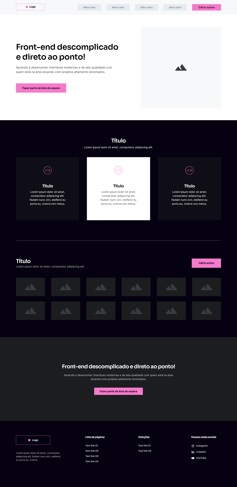

# Projeto Wireframe - Curso de Front End (Codeboost)

Essa página faz parte de um exercício aplicado no curso CodeBoost, onde o professor Wil Moreira ministra 
uma aula mostrando a melhor forma de desenvolver uma página simples (landpage) utilizando HTML e CSS apenas e como também,
extraindo todos os assets do wireframe/prótotipo feito no Figma.

Resultado final você pode ver no screeshot abaixo:

Obs.: Não foi feito a parte responsiva dessa página ainda.
